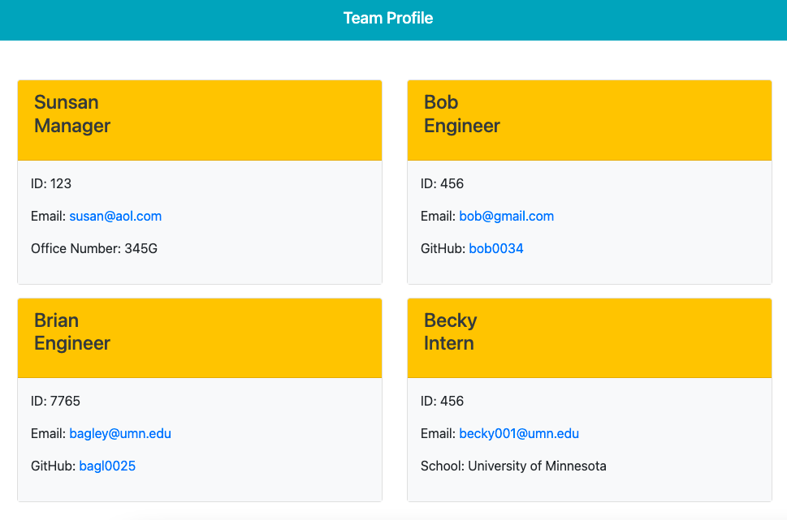

  
  # Team Profile Generator

  
  

  

  This is a Command Line Interface (CLI) app that uses NodeJS, Inquirer, and Jest to gather employee information using a series of prompts. By default the first employee you enter will be the manager. You will then be presented with a choice to enter an engineer or intern. Continue entering employees until you are done. If you select engineer you will have to provide a Github account name and if you select intern you will be asked for a school name. When you are finished select `Finish Roster` to end the program an generate a web page that summarizes your employee list.

  # Table of Contents
  * [Installation](#installation)
  * [Usage](#usage)
  * [License](#license)
  * [Contribute](#contribute)
  * [Test](#test)
  * [Questions](#questions)
  * [Github Profile](#github)
    
  ## Installation
    1. At the Github repo under the `code` button select ssh or https 
       and copy the link. 
    2. At the command prompt navigate to the folder you want the repo in 
       and type `git clone` and paste in the link you copied. 
    3. Navigate to the folder created by the clone process. 
    4. Install the required packages by typing: `npm install`.
    5. Type `node index` to run the program.
    
  ## Usage
  To execute the program type `node index` and answer the prompts that follow. 
  
  For more information on usage watch the following video (You can download this video from `./src/team-profile-demo.mov`):

  https://user-images.githubusercontent.com/43792505/168172324-89116da0-bf64-4497-9be6-fc69e53b2f22.mov

  This screenshot shows the index.html file that was produced in the demo movie.

  

  Here is a link to the index.html file produced in the video. It is located in the repo's `dist` folder.  

  [index.html produced in video](./dist/index.html)

  ## License
  This software is under the [MIT](https://opensource.org/licenses/MIT) license.
  ## Contribute
  Refer to [Contributor Covenant](https://www.contributor-covenant.org/) for contribution guidelines.
  ## Test
  This program uses the Jest module for testing. Tests have been written for several modules, they can be found in the __tests__ folder. You can run them all using `npm test` or you can run them individually using `npm test <file-name.test.js>`.
  ## Questions
  Contact author at bagley@umn.edu for questions or to report issues.
  ## GitHub
  https://github.com/bagl0025/team-profile-generator
  
